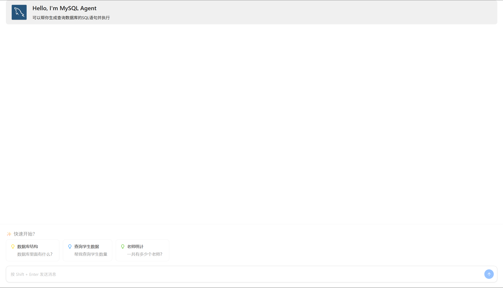
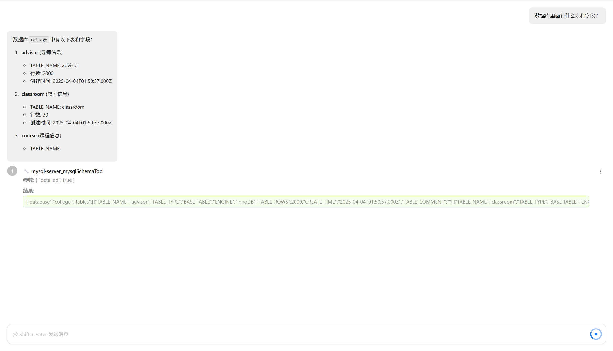

# MCP Lab 06 - Mastra MySQL Agent 对话系统

一个智能数据库查询对话系统，支持流式响应和工具调用可视化。

## ✨ 项目特性

- 🤖 **智能 MySQL Agent**
- 💬 **流式对话**
- 🔧 **工具调用可视化**
- 🏗️ **Monorepo 架构**
- 🔄 **MCP 集成**
- 📱 **现代化 UI**

## 📁 项目结构

```
mcp-lab-06/
├── apps/
│   ├── express-server/          # Express 后端服务
│   │   ├── src/
│   │   │   ├── server.ts        # 主服务器文件
│   │   │   └── mastra.ts        # Mastra 配置
│   │   └── package.json
│   └── vite-react/              # React 前端应用
│       ├── src/
│       │   ├── App.tsx          # 主应用组件
│       │   └── main.tsx         # 应用入口
│       └── package.json
├── packages/
│   └── mysql-mcp/               # MySQL MCP 包
├── turbo.json                   # Turborepo 配置
└── package.json                 # 根包配置
```

## 🚀 快速开始

### 环境要求

- Node.js >= 18
- pnpm >= 8.15.6
- MySQL 数据库

### 1. 克隆项目

```bash
git clone <repository-url>
cd mcp-lab-06
```

### 2. 安装依赖

```bash
pnpm install
```

### 3. 环境配置

在根目录下创建 `.env` 文件：

```env
QWEN_API_KEY=sk-xxxxxxxxxxxxxxxxxx
QWEN_BASE_URL=https://dashscope.aliyuncs.com/compatible-mode/v1

# 数据库配置
DB_HOST=localhost
DB_PORT=3306
DB_USER=user
DB_PASSWORD=
DB_NAME=college
```

### 4. 启动服务

#### 方式一：同时启动前后端
```bash
pnpm start
```

#### 方式二：分别启动
```bash
# 启动后端服务 (端口 3001)
pnpm start:backend

# 启动前端服务 (端口 5173)
pnpm start:frontend
```

### 5. 访问应用

- 前端界面: http://localhost:5173
- 后端API: http://localhost:3001





## 🎯 功能特性

### 智能对话
- **自然语言查询**: 用户可以用自然语言描述查询需求
- **流式响应**: 实时显示 AI 生成的回复
- **上下文记忆**: 支持对话上下文，刷新后丢失

### 工具调用可视化
- **思维链展示**: 使用 ThoughtChain 组件展示 Agent 思维过程
- **工具调用详情**: 显示函数名、参数和执行结果
- **状态反馈**: 实时展示工具调用状态（成功/失败）

### 快速开始模板
- **数据库结构查询**: "数据库里面有什么表和字段？"
- **学生数据统计**: "帮我查询学生数量"  
- **教师数据统计**: "一共有多少个老师？"

## 📡 API 文档

### 流式对话 API

```http
GET /api/stream?message=<用户消息>
```

**响应格式**: NDJSON (每行一个JSON对象)

**响应类型**:
```typescript
// 文本流块
{
  "type": "text_chunk",
  "content": "文本内容",
  "timestamp": "2024-01-01T00:00:00.000Z"
}

// 工具调用
{
  "type": "tool_call", 
  "toolCallId": "call_123",
  "functionName": "query_database",
  "arguments": { "query": "SELECT * FROM users" },
  "result": {
    "content": [{ "type": "text", "text": "查询结果..." }],
    "isError": false
  },
  "timestamp": "2024-01-01T00:00:00.000Z"
}

// 错误信息
{
  "type": "error",
  "error": "错误描述",
  "timestamp": "2024-01-01T00:00:00.000Z"
}

// 结束标记
{
  "type": "end",
  "timestamp": "2024-01-01T00:00:00.000Z"
}
```

## 🐛 故障排除

### 常见问题

**Q: 数据库连接失败**
A: 检查 `.env` 文件中的数据库配置是否正确。

**Q: 端口占用**
A: 修改 `.env` 文件中的 `PORT` 配置或停止占用端口的进程。

**Q：发送后输出为空白**
A：检查API_KEY是否有效
